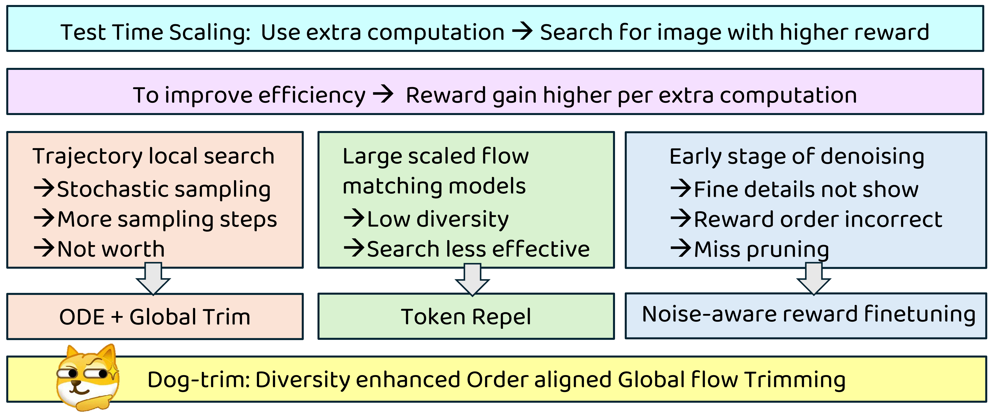

<div align="center">
# DOG-Trim
Arxiv: Rethinking Test Time Scaling for Flow-Matching Generative Models

</div>


## Introducion


## Setup
```bash
conda create --name tts python=3.12
conda activate tts
pip install transformers -U
pip install git+https://github.com/huggingface/diffusers.git
pip install torch torchvision
pip install matplotlib numba scipy accelerate einops clint ftfy timm fairscale datasets 
pip install git+https://github.com/openai/CLIP.git
```

## Run
Download the narf checkpoint : [todo]
```bash
# input prompt 
python tts/test.py --algorithm global_trim \
    --reward hpsv2 \
    --n 10 --d 7 --gamma 0.5 --repel --use_narf \
    --prompt "A dog with a shocked, bug-eyed expression"

# input a json file for all the prompts
# enable multiple GPUs
# use ensemble rewards
python tts/test.py --algorithm global_trim \
    --reward ensemble \
    --n 10 --d 7 --gamma 0.5 --repel --use_narf \
    --prompt "A dog with a shocked, bug-eyed expression"
```

---
Other baselines implemented for Flux1.dev

```bash
# Best of N
python tts/test.py --algorithm bon \
    --reward ensemble \
    --n 6

# Noise space greedy search
# Start from `n` candidates, pick the best, then search `k` rounds of `m` neighbours within radius `r`.
python tts/test.py --algorithm noise_greedy \
    --reward hpsv2 \
    --n 2 --k 2 --m 2 --r 0.15

# Noise Epsilon-Greedy Search
# Same as noise greedy, but each neighbour is fully random with probability `epsilon`.
python tts/test.py --algorithm noise_eps_greedy \
    --reward hpsv2 \
    --n 2 --k 2 --m 2 --r 0.15 --epsilon 0.4

# Search over Path (SoP)
# Denoise `d_b` steps, re-noise back `d_f` steps to spawn `m` continuations, keep the best, repeat.
python tts/test.py --algorithm sop \
    --reward hpsv2 \
    --m 4 --d_b 10 --d_f 5

# Trajectory Greedy (Local-Path)
# Replicate the best latent `n` times at each stage; SDE noise causes divergence. Requires SDE scheduler.
python tts/test.py --algorithm traj_greedy \
    --reward hpsv2 \
    --n 6 --d 7

# Early Selection
# Denoise all `n` candidates to step `d`, select the best, finish denoising to completion.
python tts/test.py --algorithm early_select \
    --reward hpsv2 \
    --n 13 --d 15

# Sequential Monte Carlo with SDE scheduler. Maintain `n` particles, resample by importance weights at each stage.
python tts/test.py --algorithm smc \
    --reward hpsv2 \
    --n 6 --d 7 \
    --lmbda 50 --tempering increase --potential max --resample ssp

python tts/test.py --algorithm smc \
    --reward pickscore \
    --n 6 --d 7 \
    --lmbda 2 --tempering increase --potential max --resample ssp

python tts/test.py --algorithm smc \
    --reward imagereward \
    --n 6 --d 7 \
    --lmbda 8 --tempering increase --potential max --resample ssp

# SMC-ODE (Pruning)
# Same as SMC-SDE but uses ODE scheduler — resampling becomes pure pruning (unique indices only).
python tts/test.py --algorithm smc_ode \
    --reward hpsv2 \
    --n 8 --d 7 \
    --lmbda 50 --tempering increase --potential max --resample ssp

python tts/test.py --algorithm smc_ode \
    --reward pickscore \
    --n 8 --d 7 \
    --lmbda 2 --tempering increase --potential max --resample ssp

python tts/test.py --algorithm smc_ode \
    --reward imagereward \
    --n 10 --d 7 \
    --lmbda 8 --tempering increase --potential max --resample ssp

python tts/test.py --algorithm smc_ode \
    --reward ensemble \
    --n 10 --d 7 \
    --lmbda 0.5 --tempering increase --potential max --resample ssp
```


## Usage of Flux1.dev Repel 
See pipeline_repel and tts/utils_flux.py 


## Usage of NARF 
In narf
```bash
# Train the model: 
cd narf
accelerate launch --num_processes=4 train.py --config configs/config_hps.yaml

# generate the dataset to train
python data/gen_data.py --d 7 --num_prompts 100 --num_gpus 2 --n 20 --prompt_file assets/hpd_train.json 
```


---
## Notes

- **Ensemble reward** scores with HPSv2 + PickScore + ImageReward and uses rank-sum for search. Individual scores `[hps, pick, imr]` are logged and saved per prompt.
- **SDE scheduler** for baselines are from [rf-inversion](https://rf-inversion.github.io/). All other methods use the ODE scheduler.
- Results are saved to `<out_root>/<run_name>.json` with per-prompt scores and timing. The run resumes automatically if the JSON already exists.
- More will be updated, if you like our work, please cite. 

